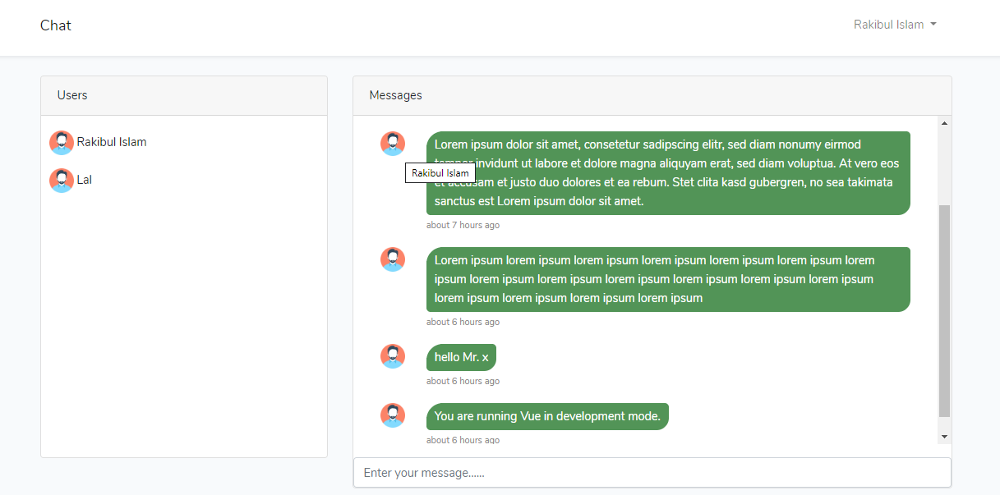

Real time chatting application built Laravel with WebSockets package, VueJs, Laravel-Echo, vue-chat-scroll, vue-timeago.

## 
- Clone this repository `git clone git@github.com:qirolab/Chat-Example-Laravel-VueJs-Websocket-.git`
- `composer install`
- `php artisan key:generate`
- copy .env.example .env and configure your database in .env file.
- configure .env with
    
    ```
    PUSHER_APP_ID= anyId
    PUSHER_APP_KEY= anyKey
    PUSHER_APP_SECRET= anySecret
    
    BROADCAST_DRIVER=pusher
    ```
- Run migration to create tables in database. `php artisan migrate`
- Final step run websockets server. `php artisan websockets:serve`
- Now test it in your browser

Special thanks to [qirolab](https://github.com/qirolab/Laravel-WebSockets-Chat-Example)
